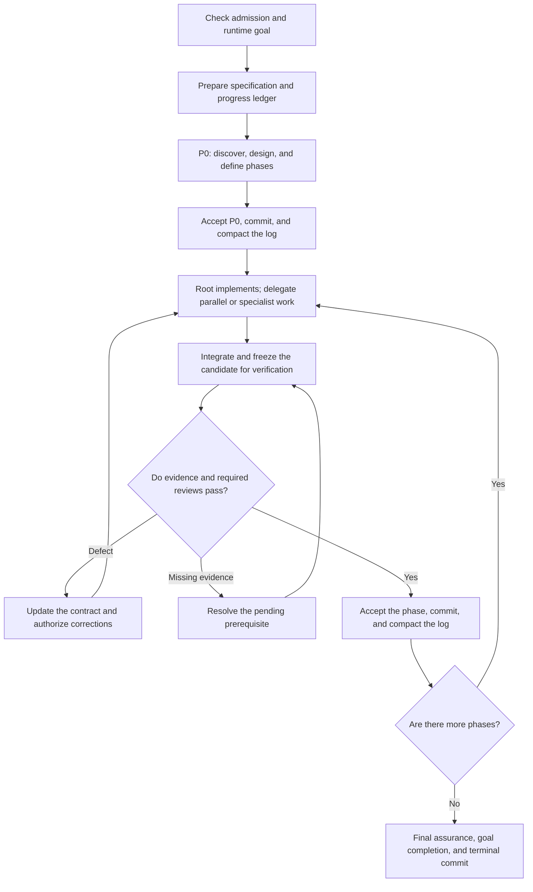

# Astra Forge

**Give complex implementations a clear path to completion.**

Astra Forge is an orchestration skill for Codex that puts **GPT-6 Astra** in charge of taking a feature request through planning, implementation, review, and delivery. Astra defines the technical direction, implements the main work, and delegates bounded assignments when parallel execution or a specialist's method helps. It brings the result together against explicit completion criteria.

It is built for work that needs sustained attention: features spanning several components, changes with subtle failure paths, and implementations that continue across sessions. You provide the objective and constraints. Astra coordinates the agents, follows up on gaps, and keeps a record of what is ready, what is verified, and what still needs work.

## Keep the whole implementation moving

A feature often spans design decisions, coordinated code changes, and integration checks. Astra Forge gives those responsibilities a common workflow, with one lead agent accountable for the result.

- **A plan grounded in your project.** Astra examines the existing code and requirements, defines component responsibilities, and breaks the work into phases with observable outcomes.
- **Focused execution.** Astra implements a single general assignment directly. When useful independent work is available, it takes one assignment and delegates others. Specialists handle cores that benefit from their methods. Every implementer has a clear scope, relevant sources, and ownership of specific files or systems.
- **Review built into the plan.** Verification requirements are chosen before implementation. The evidence needed to accept a phase is part of the assignment from the start.
- **Corrections carried through.** Astra evaluates findings, coordinates fixes, and checks the affected behavior again before accepting the work.
- **Progress you can inspect and resume.** A persistent ledger and phase commits connect the implementation to its decisions, validation results, and next steps.

Routine technical choices stay with the agents. Questions return to you when a missing decision materially affects the approved scope or required behavior and cannot be resolved from the available sources.

## Different models, coordinated by Astra

Astra Forge chooses the executor before selecting models for delegated work. The lead Astra agent implements with its runtime configuration while retaining responsibility for architecture, scope, integration, and acceptance. Coordination that unblocks other agents takes priority over its local implementation.

| Model | Delegated work | Delegated effort |
| --- | --- | --- |
| **GPT-6 Astra** | All general, specialist, correction, and final reviews; implementation requiring elevated reasoning about invariants, concurrency, recovery, algorithms, or uncertain failure behavior. | `low` through `xhigh` |
| **GPT-5.6 Sol** | Implementation requiring moderate reasoning to adapt established patterns or resolve bounded choices across well-understood components. | `medium` through `xhigh` |
| **GPT-5.6 Terra** | Conventional implementation where established project patterns and bounded dependencies suffice. | `medium` through `xhigh` |
| **GPT-5.6 Luna** | Focused exploration and standalone command execution for long-running validation campaigns or scripts, when delegation helps coordination or parallel progress. | Fixed `high` |

The assignment type determines the model before effort is selected; implementation at the Sol–Astra boundary goes to Astra. Variable effort follows shared criteria within the selected model's category, using the lowest adequate level. Except for Luna, choosing `high` or `xhigh` requires a brief recorded justification; prior attempts at lower effort are unnecessary. Review effort follows the review's own obligations, independently of implementation effort. The [delegation policy](skills/astra-forge/references/delegation.md#effort-selection) defines the criteria; `max` and `ultra` are excluded from delegated work.

The role and model are selected separately. A general implementer handles ordinary application work; specialists can take on algorithmic cores or state transitions when their methods help establish correctness. General and security reviewers assess the relevant behavior independently.

Commands and validation needed to complete an assignment stay with its executor. The lead agent runs other standalone commands directly, including quick commands.

Agents receive self-contained or bounded assignment context; full conversation history is excluded. Fresh reviewers start without inherited conversation or earlier verdicts. This keeps context focused and gives reviews an independent basis in the requirements, code, and evidence.

The approach aims to use compute efficiently by limiting duplicated context and matching reasoning effort to the work. Actual cost and speed depend on the task, available parallelism, and the amount of review and correction required.

## From request to delivery

The workflow advances through accepted outcomes. Every phase has a purpose, dependencies, and evidence that determines whether it is ready to close.



1. **Understand and design.** Astra establishes the goal, reads the requirements, and investigates the project in an initial discovery phase, P0. It defines the solution, identifies uncertain assumptions, and maps requirements to implementation phases and acceptance evidence.
2. **Assign and implement.** Once a phase's dependencies are accepted and recorded, Astra selects the executors, implementing general work itself and delegating useful parallel or specialist assignments. It records its own scope and obligations in the ledger and supplies contracts to subagents. All writers have separate ownership; delegated implementers bring architectural or scope gaps back to Astra for resolution.
3. **Integrate and verify.** Astra combines the changes and holds the version under review stable. Validation and any required independent reviews are tied to that version, so acceptance reflects the actual deliverable.
4. **Correct and checkpoint.** Confirmed defects lead to focused corrections and renewed verification of affected behavior. Each accepted phase is committed with its progress record before dependent work begins. The working log is then condensed for easier continuation.
5. **Check the complete result.** Astra evaluates cumulative requirements coverage and interactions between phases, obtains further review where needed, and closes the goal and final checkpoint. The handoff explains the changes, validation, and remaining limitations.

Phase checkpoints use local Git commits when a repository exists and there are changes to record. They provide a history of accepted work and a basis for recovery after interruptions.

## Verification proportional to the change

Astra Forge selects each phase's verification mode and acceptance obligations before its first implementation change; read-only discovery requires that decision before acceptance. Each implementer receives its share of those obligations, while acceptance covers the phase as a whole.

Root evidence can establish bounded, local, reversible work through reproducible checks. Material boundary changes or acceptance requiring substantive judgment need independent general review. Specialist review is added when a changed boundary presents a material failure mode that root evidence and general review cannot adequately assess. The [verification selection policy](skills/astra-forge/references/delegation.md#select-verification-before-writes) defines these modes. The same requirements apply when the lead agent implements the work.

Review findings distinguish confirmed defects from missing evidence and optional improvements. Required evidence must be established before acceptance; suggestions do not automatically expand the scope. Corrections continue with the same reviewer when the assignment is unchanged, and unaffected review evidence is retained with a brief justification instead of repeating the entire review portfolio. Existing checks are reused when they remain valid, and new tests are added only when explicitly required or justified as indispensable.

This gives the implementation a defined correction loop: identify the failed obligation, fix it within scope, and verify the affected result. If the same guarantee fails again after a correction, the lead agent revisits the underlying assumption and equivalent paths before another attempt, briefly recording the corrected rule in the existing ledger. Unresolved blockers remain visible in the progress record.

## A record that supports the next session

Long implementations need continuity. Astra Forge keeps requirements, technical decisions, and execution progress in a small set of documents:

| Document | What it gives you |
| --- | --- |
| **Specification** | The source of requirements and acceptance criteria. A supplied specification is reused; otherwise, the user's requirements are captured in `docs/PLAN-SPECS-{context-id}.md`. |
| **Design** | Material technical decisions and their rationale in `docs/PLAN-DESIGN-{context-id}.md`, created when needed and maintained across phases. |
| **Progress ledger** | The plan, phase status, active responsibilities, essential evidence, blockers, and next actions in `.astra-forge/PLAN-PROGRESS-{context-id}.md`. |

The specification stays protected unless you explicitly request edits to it. Technical decisions remain traceable to the requirements they serve.

On resume, Astra reconciles these records with the actual workspace, goal, and agent state. Valid completed work can be reused, while changed or uncertain evidence is checked before execution continues.

## Try it on your next implementation

With the skill and required agent roles available in Codex, **GPT-6 Astra** is the recommended primary model. Other primary models require explicit skill invocation; delegated work still follows the configured model policy. Describe the outcome:

```text
Use $astra-forge to implement [objective] in this project.
```

An existing specification gives the run a clear starting point:

```text
Use $astra-forge to implement the CSV export feature described in docs/export-spec.md.
Follow the existing authorization rules and preserve the current report API.
```

You can also start from a feature description. Include the behavior you need, important constraints, and what would count as a successful result; Astra uses those sources to establish the implementation plan.

The workflow requires runtime goals, subagents, and access to the configured models and roles. Explicit invocation admits a run; automatic use requires runtime confirmation of Astra as the lead agent and a task that benefits from orchestration.

Astra Forge is a good fit for features spanning multiple components, work with meaningful integration or recovery risks, and longer tasks that benefit from checkpoints. Small, straightforward edits usually need less coordination.

## Repository contents

| Path | Contents |
| --- | --- |
| [skills/astra-forge/SKILL.md](skills/astra-forge/SKILL.md) | Main skill definition and operating rules. |
| [skills/astra-forge/references/](skills/astra-forge/references/) | Detailed workflow policies and assignment templates. |
| [skills/astra-forge/agents/openai.yaml](skills/astra-forge/agents/openai.yaml) | Skill metadata and default prompt. |
| [agents/](agents/) | Agent configurations for specialized implementation, general review, and security review. |
